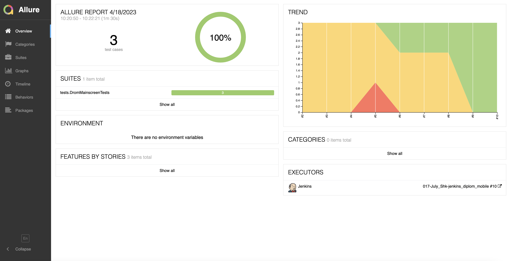
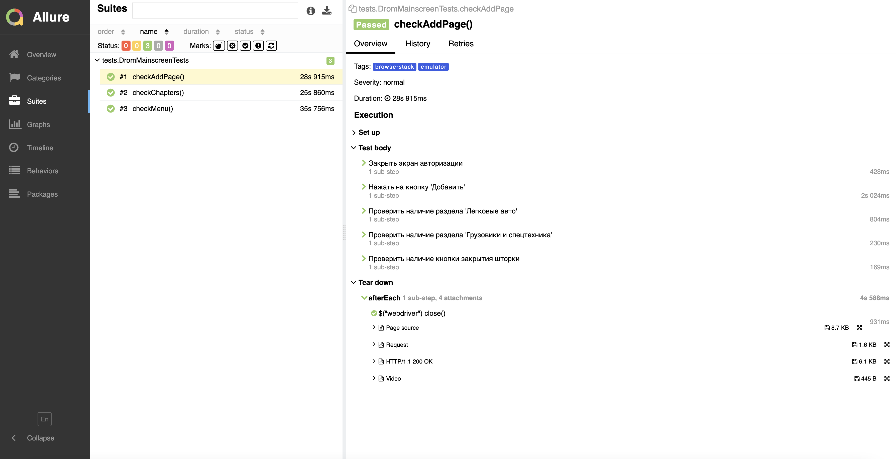
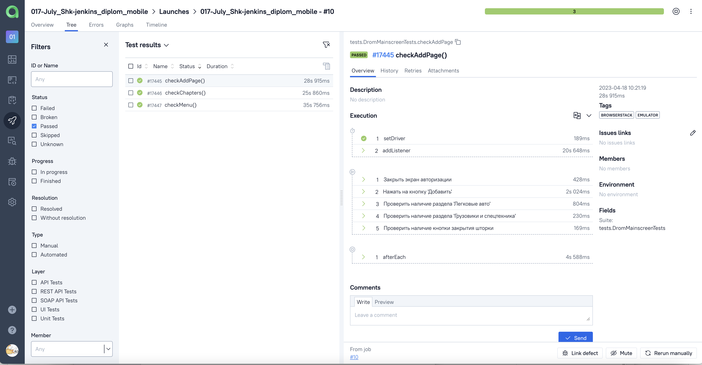
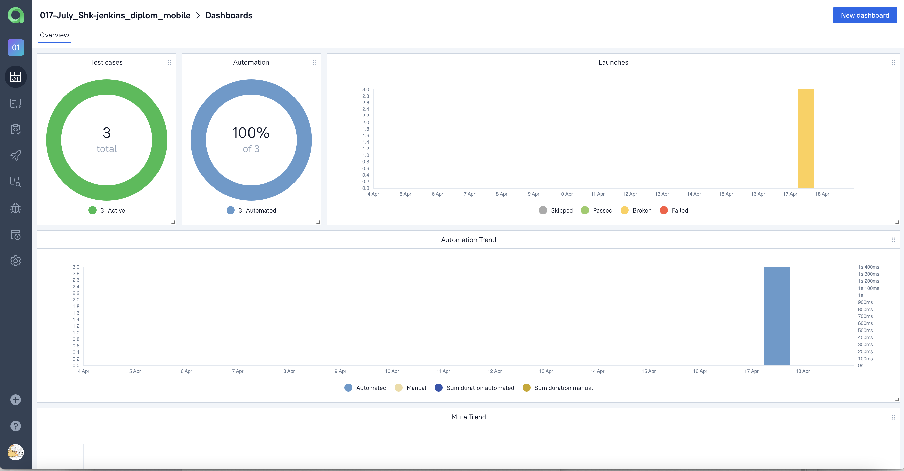
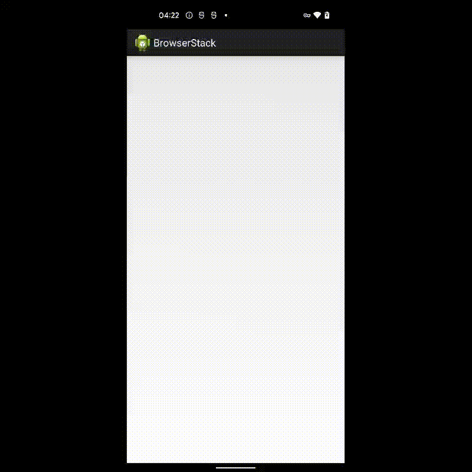

# Проект по автоматизации тестирования мобильного приложения Drom.ru
## :receipt: Содержание:

- Технологии и инструменты
- Реализованные проверки
- Запуск тестов
- Allure-отчет
- Интеграция с Allure TestOps
- Видео пример прохождения тестов

## :computer: Технологии и инструменты

<p align="center">
<a href="https://www.jetbrains.com/idea/"></a>
<a href="https://www.java.com/"></a>
<a href="https://github.com/"></a>
<a href="https://junit.org/junit5/"></a>
<a href="https://gradle.org/"></a>
<a href="https://selenide.org/"></a>
<a href="https://aerokube.com/selenoid/"></a>
<a href="https://github.com/allure-framework/allure2"></a>
<a href="https://https://qameta.io/"></a>
<a href="https://www.jenkins.io/"></a>
<a href="https://https://telegram.org/"></a>
</p>

## :mag_right: Реализованные проверки

Автоматизированные тесты
- ✓ Проверка разделов на главном экране приложения
- ✓ Проверка пунктов меню
- ✓ Проверка разделов при подаче объявления о продаже

## :arrow_forward: Запуск тестов

###  Локальный запуск :
Пример командной строки:
```bash
gradle clean test -DdeviceHost=browserstack
```
Получение отчёта:
```bash
allure serve build/allure-results
```

###  Удаленный запуск (в Jenkins):
1. Открыть <a target="_blank" href="https://jenkins.autotests.cloud/job/017-July_Shk-jenkins_diplom_mobile/">проект</a>


2. Выбрать пункт **Собрать сейчас**
3. Результат запуска сборки можно посмотреть в отчёте Allure

## </a> Отчет в <a target="_blank" href="https://jenkins.autotests.cloud/job/017-July_Shk-jenkins_diplom_mobile/10/allure/">Allure report</a>

###  Главное окно

<p align="center">

</p>

###  Тесты

<p align="center">

</p>


## </a> Интеграция с <a target="_blank" href="https://allure.autotests.cloud/launch/22173">Allure TestOps</a>
### Общий список всех кейсов
<p align="center">

</p>

### Dashboard с общими результатами тестирования
<p align="center">

</p>

## </a> Видео прохождения тестов

<p align="center">
  
</p>
